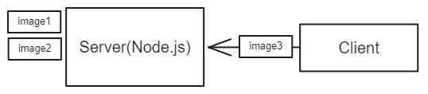
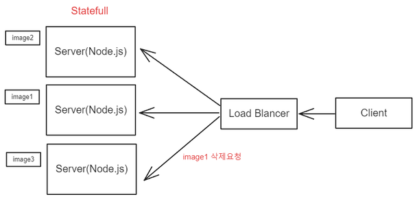
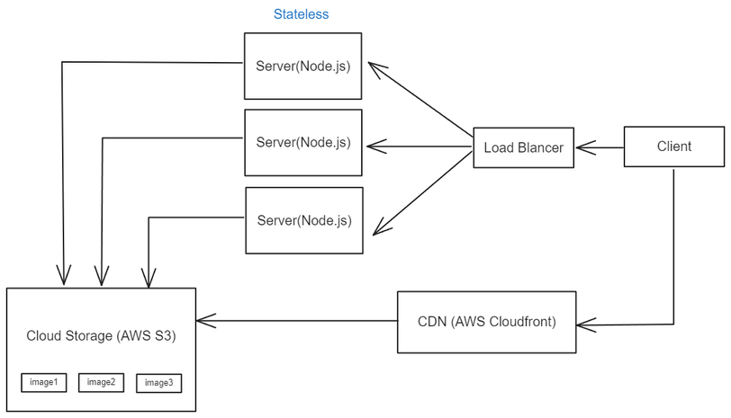
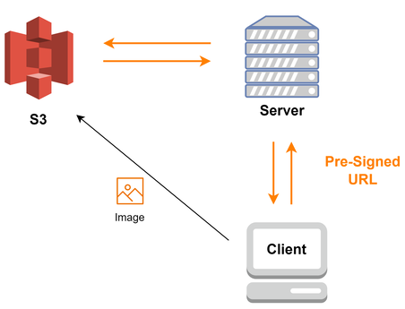
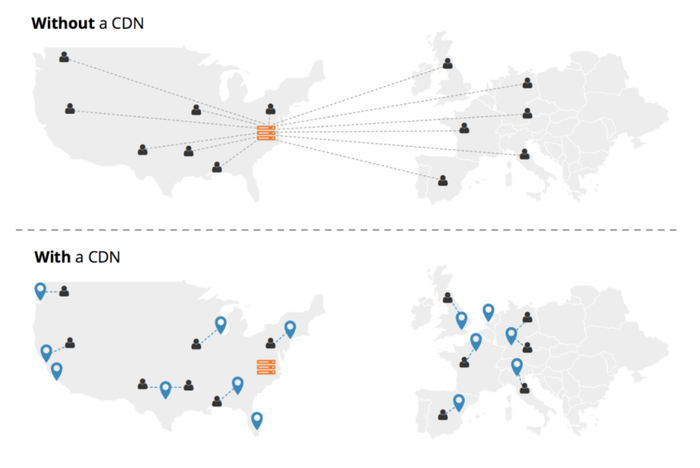
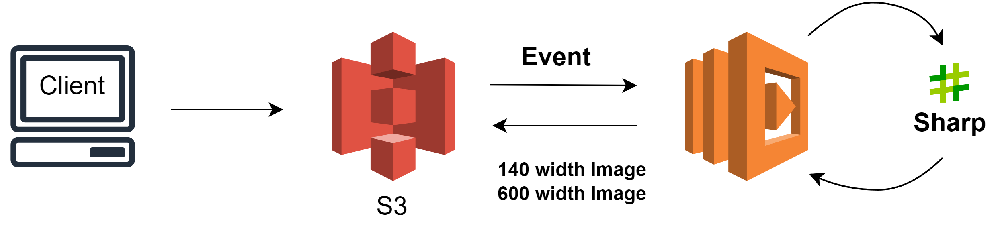

# 주요 포인트

이번 글에서는

- **고용량 이미지로 인한 로딩 속도 문제를 해결한 경험**
- **그 과정에서 발생한 일에 대한 회고**
- **더 나은 해결책**

에 대해 이야기 해보겠습니다.

# 시작하기 전

웹 뷰 모바일 앱을 개발하면서 고용량의 이미지로 인해 페이지 로딩 속도가 현저하게 느려지는 문제를 만나게 되었습니다. 이 문제를 해결하기 위해 Sharp 라이브러리를 도입하여 이미지 압축을 실행했고, 이를 통해 성능 문제를 개선할 수 있었습니다.

 

개인적으로, 라이브러리를 도입하여 문제를 해결한 것이 큰 성과라고 생각하지는 않지만, 라이브러리를 도입하는 과정에 진행한 **Node 버전 업그레이드**, **버전 호환을 위한 대량의 코드 수정** 그리고 **이미지를 저장하는 방식**, **이미지 처리 방법** 등에 대해 회고 해볼 필요가 있다고 생각했습니다.

 

먼저 당시 상황에 대해 간략히 이야기 해보겠습니다.

# 문제 발생

스크롤 형식의 게시판에서 한 게시물 당 최대 5개의 이미지를 목록에서 보여주도록 변경하였고, 카메라로 촬영한 사진을 바로 등록할 수 있도록 기존 2MB 제한을 풀어 10MB로 늘렸습니다.

 
 

 
 

카메라로 직접 촬영한 사진을 게시하는 경우가 많았는데, 이 경우 파일 크기가 평균 3MB에 달했습니다. 이런 상황에 여러 사진들이 게시물 목록에 동시에 표시되면서, 모바일 환경에서 페이지 로딩 속도가 평균 3초로 눈에 띄게 느려졌습니다.

 
 

 
 

한 번에 불러오는 게시물의 수를 10개까지 줄여보았지만, 성능적으로 유의미한 결과를 얻을 수 없었습니다.

# Sharp 도입을 통한 개선

이를 개선해달라는 지속적인 피드백이 있었지만 당시 프로젝트 Node.js 버전이 0.10 으로 압축 라이브러리 등의 다른 서드 파티의 도움을 받기가 쉽지 않았습니다.

 

그래서 Node 버전을 14까지 올리고 이미지 압축 라이브러리인 Sharp를 도입해 로딩 속도를 3초에서 1초 밑으로 개선할 수 있었습니다.

 

**Sharp 사용시 이미지 용량 변화**

1.47MB => 58.1KB

 
 

 
 

# 회고 및 개선

당시에는 이 방법이 효과적이었으며, 큰 문제 없이 원하는 결과를 얻을 수 있었습니다.

 

하지만 시간이 지나고 다시 돌아보니, 단순히 문제를 해결했다는 것 이상으로 많은 생각과 개선 가능성에 대해 고민하게 되었습니다.

 

어떤 부분에서 많은 생각이 들고, 개선 가능성이 있는지에 대해 이야기 해보겠습니다.

## 1. 이미지를 서버 자체에 저장

 
 

 
 

해당 서비스는 파일 저장을 위해 단일 서버 구조를 가지고 있었습니다. 

 

당시의 요구를 충족시키기에는 충분했지만, 서비스가 지속적으로 성장하고 있는 상황을 고려하면 단일 서버 구조는 확장 즉, **Scale Out** 을 고려하지 않는 판단이였던 것 같습니다.

 

만약 해당 서비스가 이대로 **Scale Out** 을 진행한다고 가정해보겠습니다.

 
 

 
 

만약 서비스가 수평적 확장을 통해 여러 서버에 파일 저장 기능을 분산시킨 경우, 각 서버는 고유한 데이터 상태를 가지게 될 것입니다. 이는 데이터 일관성 문제를 야기할 수 있습니다. 

 

예를 들어, 사용자가 'image1'을 삭제하도록 요청했으나, 이 요청이 'image1'파일이 없는 서버로 전송될 경우, 삭제 작업이 제대로 이루어지지 않을 수 있습니다.

 

그리고 만약 클라우드 환경이면 이미지 때문에 부하가 없음에도 불구하고 인스턴스를 유지해야하는 상황도 발생할 수 있습니다.

 

### 개선 방법

 
 

 
 

이 문제에 있어서는 Amazon S3(Simple Storage Service)와 같은 별도의 스토리지 솔루션을 사용하는 것이 좋은 방법이 될 것 같습니다. 

 

그러나 위 그림처럼 클라이언트에서 백엔드 서버로 파일을 전송한 뒤, 백엔드 서버에서 S3로 다시 파일을 전송하는 구조는 추가적인 네트워크 통신이 발생하기 때문에 성능적인 문제를 야기할 수 있습니다.

 

그렇다고 프론트에서 직접 S3로 보내는 방법은 성능적인 이점을 제공하지만 보안적인 이슈가 따라올 수 밖에 없습니다.

 
 

 
 

이 문제에 대해서는 임시 엑세스 권한을 부여하는 방식인 **Pre-Signed URL** 방식을 사용해서 해결할 수 있습니다.

1. 백엔드 서버에서 AWS의 자격증명을 사용하는 **Pre-Signed URL** 을 생성하고 이를 클라이언트에 전달합니다.
    
2. 클라이언트는 이 URL을 통해 지정된 시간 동안 S3 버킷에 파일을 직접 업로드 할 수 있습니다. 

3. S3 에 업로드 후 서버를 통해 데이터베이스에 파일 정보를 저장합니다.

 
 

 
 

추가로 웹 콘텐츠의 로딩 속도와 사용자 경험을 더욱 향상시키기 위해 AWS CloudFront와 같은 CDN을 고려하는 것도 좋은 방법일 것 같습니다.

 

CDN을 사용하면 처음에는 멀리 떨어진 S3 같은 저장소에서 데이터를 불러오지만, 이 과정에서 데이터를 사용자에게 가까운 캐시 서버에 저장하게 됩니다. 이후 요청부터는 가까운 캐시 서버에서 데이터를 불러오기 때문에 로딩 시간이 크게 단축되고, 전체적인 웹사이트의 반응 속도가 개선될 것입니다. 

 

## 2. Node 버전 업그레이드

 
 

이미지 압축 라이브러리인 Sharp를 도입하기 위해 Node 버전을 업그레이드 하였는데 이 부분에 대해 이야기 해보겠습니다.

 

크게 두가지 이슈를 가지고 Node 버전 업그레이드를 결정했습니다.

 

**1. 이미지 압축 필요성**

 

Node 0 버전에서는 이미지 압축을 지원하는 서드 파티를 찾을 수 없었고 당시에는 버전 업그레이드만이 답이라고 생각 했습니다.

 

**2. ES6 문법 미지원 (let, async-await 등)**

 

let을 지원하지 않아 var를 사용해야 했습니다. (변수 호이스팅, 함수 스코프)

또, async-await, Promise를 지원하지 않다보니 콜백 함수로 작성할 수 밖에 없었고, 콜백 함수를 중첩하여 사용하다보니 코드가 복잡해지는 경우가 많이 발생했습니다.

 

두 가지 이슈를 바탕으로 버전을 0에서 14로 업그레이드 하였고, 이러한 변경은 긍정적인 부분과 부정적인 부분이 함께 나타났습니다.

 

**긍정적인 부분**

1. 신규 프로젝트들의 버전이 Node 14로 진행

Node 14로의 버전 업그레이드 과정에서 겪은 다양한 문제들을 문서화하고 이를 사내에서 공유하였습니다. 

이러한 요소가 다른 팀이 신규 프로젝트를 진행하면서 버전 14를 선택하는 데 긍정적인 영향을 미쳤습니다.

2. 콜백 함수 해결

Node 0에서 사용되던 복잡한 콜백 기반 코드를 Node 14의 async-await 문법을 사용하여 직관적인 코드로 리팩토링할 수 있었습니다. 이 변경을 통해 가독성과 유지 보수성을 크게 향상 시킬 수 있었습니다.

 

**부정적인 부분**

1. 코드 호환성 문제로 인한 많은 코드 수정

버전 0에서 14로의 전환은 여러 코드 호환성 문제를 야기했습니다. 

특히 클라이언트에서 전송된 데이터를 처리하는 부분에서 기존 코드와 호환되지 않아, 프로젝트의 모든 요청 처리 코드를 수정해야 했습니다. 또한 이미지나 다른 파일들을 받아 처리하는 API의 경우, multer를 추가로 도입하여 수정 작업을 진행해야 했습니다.

2. 테스트에 드는 많은 시간

테스트 코드 부재로 리팩토링을 통해 코드를 수정할 때마다 수동으로 테스트를 반복해야 했습니다.

 

### 프로젝트 접근 방식에 대한 고찰

레거시 시스템의 개편을 통해 좋은 경험을 얻었지만, 현재 돌이켜보니 이미지 처리를 위한 별도의 서버를 새로 구축하는 것이 더 효율적인 접근 방식이었을 것 같습니다. 

당시 프로젝트는 시간적 제약이 많았고, 문제 해결을 위해 과도하게 많은 리소스를 투입한 것에 대한 아쉬움이 남습니다.

 

별도의 서버를 새로 구축하는 이야기는 이미지 처리 방식에 대한 회고에서 같이 이야기 하겠습니다.

 

## 3. 이미지 처리 방식

해당 서비스는 API 서버가 이미지를 즉시 수신하여 압축 등의 처리하는 방식을 사용했습니다. 

API 서버의 주 업무는 요청을 처리하여 응답하는 것 입니다. 이미지 처리와 같은 CPU를 많이 사용하는 작업을 동시에 처리하게 되면 서버의 응답 시간이 느려지고 시스템 전체의 안정성에 영향을 줄 수 있다고 생각합니다.

 

위에서 말한 Node 버전 업그레이드 부분과 이미지 처리 방식을 회고해보면 별도의 서버를 새로 구축하는 방법을 선택 했으면, 시간 자원도 아끼고 API 서버와 처리 자원을 공유하는 일도 벌어지지 않았을 것입니다.

 

### 개선 방안

 
 

이미지를 S3 같은 외부 스토리지에 저장한다고 했을 때 좋은 방법으로 AWS Lambda 같은 서버리스(Serverless)를 사용하는 방법이 있습니다.

Lambda는 각 기능을 함수 단위로 등록하고, 이벤트 트리거를 통해 해당 함수를 호출하여 실행하는 방식입니다.

Lambda에서 Sharp 라이브러리를 사용하여 이미지 리사이징 작업을 수행하고, 결과물을 Amazon S3 같은 외부 스토리지에 저장합니다. 이렇게 저장된 이미지는 클라이언트에서 필요에 따라 적절하게 사용할 수 있습니다.

 

이런 방식을 통해 처리 부하를 분산시키고, API 서버가 본래의 업무에 집중할 수 있도록 하여 전체 시스템의 효율성과 안정성을 향상시킬 수 있을 것 입니다.

 

# 마치며

최선의 해결 방법이 아니었을 수도 있습니다. 그러나 문제를 해결하기 위해 동료들과 함께 고민하고 시도했던 과정은 저를 성장시키는 데 큰 도움이 되었습니다. 그리고 문제를 해결했을 때의 엄청난 성취감은 말로 표현할 수 없었습니다.

 

당시 Node 환경을 개선하고 이미지 처리 방법을 변경하지 않았다면, 분명 후회했을 것입니다. 만약 여러분도 어떤 문제에 대해 고민 중이라면, 저는 시도해보시길 권장합니다. 실패하더라도 그 과정에서 배우는 것이 있을 것입니다.

 

읽어주셔서 감사합니다.

