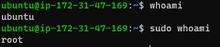
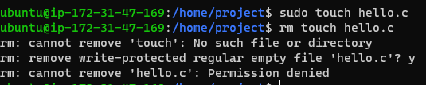
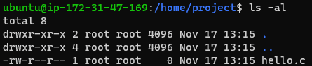
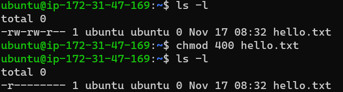
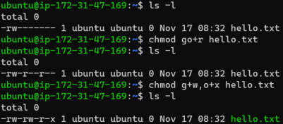
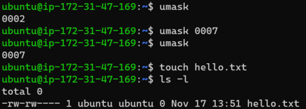

<br>

# 리눅스와 윈도우, 사용자 권한 관리의 근본적 차이

윈도우는 개인 사용자 중심의 운영 체제로 태어났습니다. 처음에는 사용자 계정이 필요 없었을 만큼, 각 사용자가 자신의 PC에서 전체적인 관리자 권한을 가질 수 있었습니다. 

<br>

반면, 유닉스는 태생 자체가 여러 사용자가 동시에 접속하여 작업할 수 있는 멀티유저 시스템으로 설계되었습니다. 

컴퓨팅의 초기 시절, 컴퓨터는 메인프레임이라 불리는 거대하고 비싼 기계로, 보통 한 대를 여러 사람이 공유하는 형태였습니다. 이 때문에, 사용자들은 터미널이라고 불리는 단말기를 통해 물리적으로 서버가 위치한 방에 가지 않고도 원격으로 서버에 접속할 수 있었습니다. 이 터미널들은 사용자에게 서버에 명령어를 보내고 그 결과를 받을 수 있는 인터페이스를 제공했습니다. 

이러한 컨셉은 현대에도 계승되어, 우리가 오늘날 사용하는 셸(shell)이나 배시(bash) 같은 명령 줄 인터페이스(CLI)를 '터미널'이라고 부르는 근거가 되었습니다.

<br>

리눅스는 유닉스의 후계자이자 오픈소스 대표 운영체제로서 멀티유저의 원칙을 계승하면서 발전했습니다. 

# 리눅스 일반 사용자부터 슈퍼 유저까지

리눅스에서는 이러한 멀티유저 환경 때문에, 각 사용자의 권한이 세분화되어 있습니다. 

### 관리자 (또는 슈퍼 유저, root)

시스템 전반에 걸쳐 광범위한 권한을 가집니다.

### 일반 사용자

각각 설정된 제한된 권한을 가집니다.

### 관리자 권한을 수행할 수 있는 사용자

관리자 권한이 필요한 작업을 수행해야 할 때 sudo 명령어를 사용하여 임시로 슈퍼유저 권한을 얻어 수행할 수 있습니다.

예를 들어, whoami 명령어는 현재 사용자를 나타내지만, sudo whoami를 실행하면 root가 출력됩니다. 즉, sudo를 사용할 때마다 사용자는 root의 권한으로 명령을 실행하게 됩니다.

<br>
<center>



</center>
<br>

하지만 무분별한 sudo 사용은 주의가 필요합니다. 예를 들어 sudo 권한으로 파일을 생성할 경우 일반 사용자가 수정하거나 삭제하기 어려워 질 수 있습니다.

<br>
<center>



</center>
<br>

# 리눅스 파일 시스템의 권한 구조

리눅스 파일 시스템에서 파일과 디렉토리의 권한은 10글자 문자열로 표현됩니다.

<br>
<center>



</center>
<br>

## 파일 타입

리눅스에서 파일 권한을 나타내는 10자리 문자열에서 맨 앞자리는 파일 타입을 나타냅니다.

- \- : 일반 파일(regular file)
  
- d : 디렉토리(directory)
  
- l : 심볼릭 링크(symbolic link)

## 권한 그룹

나머지 9자리는 세 개의 권한 그룹으로 나누며, 각 권한 그룹은 다음과 같습니다.

- 첫 번째 : 파일 소유자(Owner)의 권한
  
- 두 번째 : 그룹(Group)의 권한
  
- 세 번째 : 기타(Other) 사용자의 권한

이 권한들은 각각 숫자로 표현되며, 이는 권한 설정을 위한 이진수 연산의 기반이 됩니다:

- r : 읽기(read) 권한, '4'
  
- w : 쓰기(write) 권한, '2'
  
- x : 실행(execute) 권한, '1'

## 권한 설정

각 권한을 조합하여 파일이나 디렉토리에 대한 권한을 설정할 수 있습니다:

```shell
chmod 400 [파일명] # 파일 소유자에게 읽기 권한만 부여 (r--------)
chmod 777 [파일명] # 모든 사용자에게 모든 권한 부여 (rwxrwxrwx)
```

<br>
<center>



</center>
<br>

- 읽기, 쓰기 : 4 + 2 = 6

- 읽기, 엑세스 : 4 + 1 = 5

- 모든 권한(rwx) : 1 + 2 + 4 = 7

<br>

숫자말고 문자로 권한을 바꾸는 방법도 제공하고 있습니다.

```shell
# 예시
chmod u+r [파일명] # 소유자에게 읽기 추가
chmod u+w [파일명] # 소유자에게 쓰기 추가
chmod g+x [파일명] # 그룹에게 실행 추가
chmod o+rw [파일명] # 기타 사용자에게 읽기, 쓰기 추가
chmod o-rw [파일명] # 기타 사용자에게 읽기, 쓰기 제거
chmod g-r [파일명] # 그룹에게 읽기 제거
```

<br>
<center>



</center>
<br>

## umask를 사용한 기본 권한 설정

리눅스에서 파일과 디렉토리 생성 시 기본 권한은 umask 값에 의해 결정됩니다. umask는 시스템이 새로운 파일과 디렉토리에 자동으로 적용하는 권한 마스크입니다. 이 마스크는 특정 권한을 제거하는 데 사용됩니다.

umask의 기본 값은 보통 0002입니다. 이 값은 새로 생성되는 파일과 디렉토리에 대한 기타 사용자(other)의 쓰기 권한(write)을 제거하도록 설정됩니다. 

<br>

맨 앞의 0은 특수 권한(SUID, SGID, Sticky Bit)을 위한 자리이며, 대부분의 경우에는 0으로 설정됩니다. 

만약 새로운 파일이나 디렉토리에 대해 기타 사용자에게 아무런 권한도 주고 싶지 않다면, umask를 0007로 설정할 수 있습니다. 이렇게 설정하면 새로 생성되는 모든 파일은 rw-rw---- 권한을, 새 디렉토리는 rwxrwx--- 권한을 가지게 되어, 기타 사용자에게는 어떤 권한도 주어지지 않습니다.

<br>
<center>



</center>
<br>

umask 값은 사용자가 원하는 기본 권한 설정에 따라 변경할 수 있으며, 시스템의 보안 정책이나 팀의 협업 방식에 맞게 조정할 수 있습니다.

<br>

## 특수 권한 비트 이해하기

리눅스 시스템에서 파일과 디렉토리에 특별한 동작을 부여하는 데 사용되는 특수 권한 비트는 chmod 명령어를 통해 설정할 수 있습니다. 이 비트들은 표준 파일 권한을 넘어서는 추가적인 권한을 제공하며, 다음 세 가지가 가장 일반적입니다.

<br>

### Set User ID (SUID)

SUID가 설정된 실행 파일은 사용자에게 파일 소유자의 권한으로 실행될 수 있는 권한을 부여합니다. 이는 디렉토리에는 적용되지 않습니다. 

예를 들어, 만약 myapp이라는 실행 파일에 SUID 비트가 설정되어 있고, 사용자가 이 파일을 실행하면, myapp은 해당 사용자가 아니라 파일의 소유자 권한으로 실행됩니다.

사용자가 파일의 권한을 초과하여 특정 작업을 수행할 수 있게 해주지만, 시스템 로그에는 실행한 사용자의 실제 아이디가 기록됩니다. SUID 비트는 프로세스의 권한을 변경하는 것에만 영향을 주며, 시스템의 감사 로그(audit logs)에는 보안 상의 이유로 실제 사용자의 아이디를 기록하여 실행 행위를 추적할 수 있게 합니다.

```shell
chmod u+s [파일명]
chmod 4XXX [파일명] # XXX는 권한설정(r,w,x)
```

<br>

### Set Group ID (SGID)

이 비트가 설정된 실행 파일은 파일의 그룹 권한으로 실행됩니다. 

디렉토리에 SGID가 설정되면, 해당 디렉토리 내에서 생성된 모든 새 파일과 디렉토리는 그 디렉토리의 그룹 ID를 상속받아 그룹 소유권이 유지됩니다. 이는 파일 공유 및 협업이 이루어지는 환경에서 파일의 그룹 소유권을 일관되게 유지하는 데 유용합니다.

```shell
chmod g+s [파일명 or 디렉토리명]
chmod 2XXX [파일명 or 디렉토리명] # XXX는 권한설정(r,w,x)
```

<br>

### Sticky Bit

주로 공용 디렉토리에 설정된 Sticky Bit는 해당 디렉토리 내의 파일을 생성한 사용자만이 파일을 삭제할 수 있게 합니다. 

이 비트가 설정된 디렉토리 내에서는, 심지어 동일한 그룹에 속한 다른 사용자들조차도 다른 사람이 생성한 파일을 삭제할 수 없습니다. (root는 가능)

예를 들어, 시스템의 /tmp 디렉토리에는 여러 사용자가 임시 파일을 생성할 수 있으며, Sticky Bit는 이 사용자들이 서로의 파일을 실수로나 악의적으로 삭제하는 것을 방지합니다. 

```shell
chmod o+t [디렉토리명]
chmod 1XXX [디렉토리명] # XXX는 권한설정(r,w,x)
```