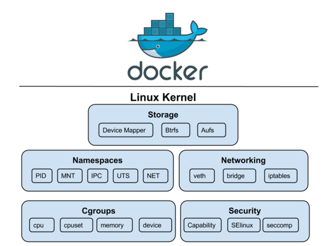

 

## Docker가 뭐야? 그리고 왜 사용해?

도커(Docker)는 컨테이너 기술로, 하이퍼바이저 기반의 가상화와는 다른 접근 방식을 사용합니다. 

>하이퍼바이저(Hypervisor)를 이용한 가상화는 하나의 물리적 서버에서 여러 가상 머신(VM)을 구축하여 운영하는 방식 입니다. 여기서 하이퍼바이저는 가상 머신들을 생성, 관리, 격리하는 중요한 역할을 수행합니다.

하이퍼바이저 가상화가 각 가상 머신에 독립된 운영 체제를 제공하는 반면, 도커는 격리된 환경인 컨테이너에 애플리케이션을 패키징하여 운영 체제를 공유함으로써 리소스를 보다 효율적으로 활용합니다. 이로 인해, 도커는 경량화되어 빠르게 시작하고, 수평적으로 확장이 용이하며, 마이크로서비스 아키텍처에 적합합니다.

그리고 컨테이너는 애플리케이션과 모든 종속성을 함께 포장하여, 개발된 환경을 그대로 다른 곳에서도 재현할 수 있게 해줍니다.

가상 머신 환경에서는 작은 규모의 스케일 아웃을 위해서도 큰 용량의 OS 이미지가 필요했지만, 도커를 사용하면 필요한 컨테이너만 추가하여 리소스를 절약할 수 있습니다. 또한, 하나의 컨테이너가 실패해도 다른 컨테이너가 작업을 계속 수행할 수 있어 서비스의 연속성을 지원합니다.

## 도커와 리눅스 커널

컨테이너를 가능하게 하는 기술적 기반은 바로 리눅스 커널에 있습니다. 리눅스 커널은 다음과 같은 핵심 기능들을 제공합니다.

### 1. chroot

각 컨테이너에 독립된 파일 시스템 환경을 제공합니다. 이는 프로세스가 루트 디렉토리를 변경하게 하여, 마치 별도의 독립된 시스템에서 실행되는 것처럼 만듭니다.

### 2. namespace

프로세스, 네트워크, 사용자 등의 시스템 리소스를 격리합니다. 여기에는 6가지 주요 종류의 네임스페이스가 있으며, 각각은 시스템의 특정 부분을 격리하여 컨테이너가 마치 전체 시스템을 독립적으로 소유한 것처럼 동작하게 합니다.

- PID (Process ID) namespace  
  
    프로세스 ID 번호를 격리하여, 컨테이너 내의 프로세스가 시스템의 다른 프로세스와 동일한 ID를 가질 수 없도록 합니다.
  
- Net (Network) namespace  
    
    네트워크 인터페이스(예: IP 주소, 포트 번호)를 컨테이너별로 격리하여, 각 컨테이너가 독립적인 네트워크 스택을 가질 수 있게 합니다.  

- Mount (File System) namespace   
        
    파일 시스템 마운트 포인트를 격리하여, 컨테이너가 자신만의 파일 시스템을 가질 수 있게 되며, 다른 컨테이너의 파일 시스템에 영향을 주지 않습니다.
    
- IPC (Inter-Process Communication) namespace  
        
    프로세스 간 통신(IPC) 리소스를 격리하여, 컨테이너가 다른 컨테이너와 IPC 리소스를 공유하지 않도록 합니다.[2](#footnote_2)

    > 리눅스 시스템에서 프로세스들은 메시지 큐, 세마포어(신호기), 공유 메모리 등의 방법으로 서로 데이터를 공유하거나 동기화할 수 있는데, IPC namepsace를 사용하면, 한 컨테이너 안에서 실행되는 프로세스들만 그들 사이에 설정된 IPC 메커니즘을 볼 수 있습니다. 다시 말해, 한 컨테이너의 프로세스가 생성한 메시지 큐나 세마포어는 다른 컨테이너에는 보이지 않습니다.
  
- UTS (UNIX Timesharing System) namespace  

    호스트 이름과 도메인 이름을 격리하여, 컨테이너가 시스템의 나머지 부분과 다른 호스트 이름을 가질 수 있게 합니다. 즉, 여러 컨테이너가 동일한 호스트 이름을 사용할 수 있으며, 서로나 호스트 시스템과 충돌하지 않습니다
  
- User namespace  
        
    사용자와 그룹 ID를 격리하여, 컨테이너 내에서 루트로 실행되는 프로세스가 호스트 시스템에서는 비루트 권한을 가지게 할 수 있습니다

### 3. cgroups (Control Groups)

프로세스 그룹에 할당된 리소스의 양을 제한하고, 이 리소스들을 관리합니다. 이를 통해 시스템의 리소스가 공정하게 분배되고, 하나의 애플리케이션이 전체 시스템 리소스를 독점하는 것을 방지할 수 있습니다.

 

 

Docker는 리눅스 커널의 이러한 기능을 활용하여 컨테이너를 생성 및 관리하고, 사용자가 기능을 쉽게 사용할 수 있도록 추상화한 컨테이너 엔진입니다.

## 리눅스 커널이 없는 곳에서는?

Windows나 macOS와 같은 리눅스 커널이 내장되지 않은 환경에서는 Hypervisor 가상화 기술을 사용하여 리눅스 기반 컨테이너를 실행합니다.
