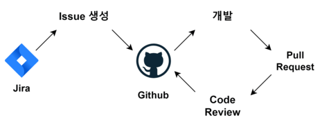
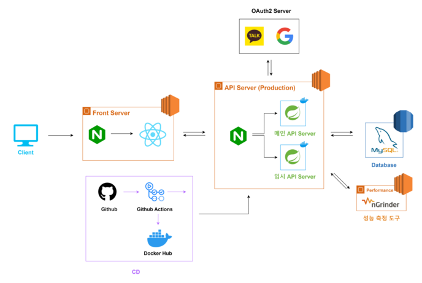
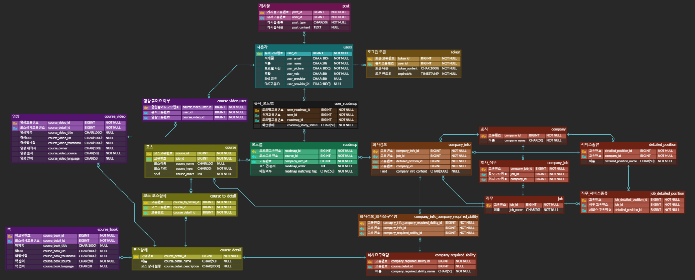
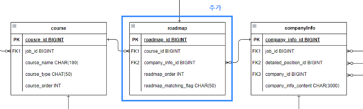
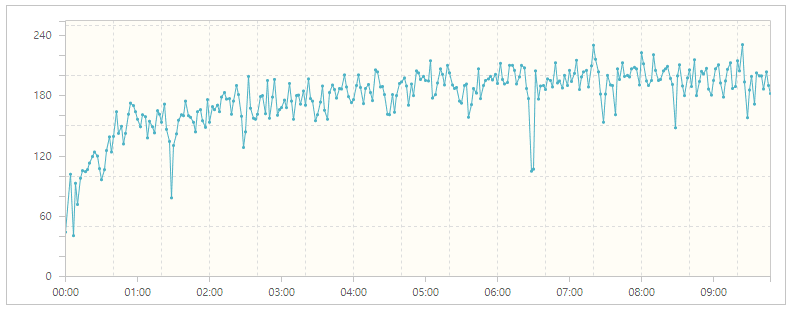
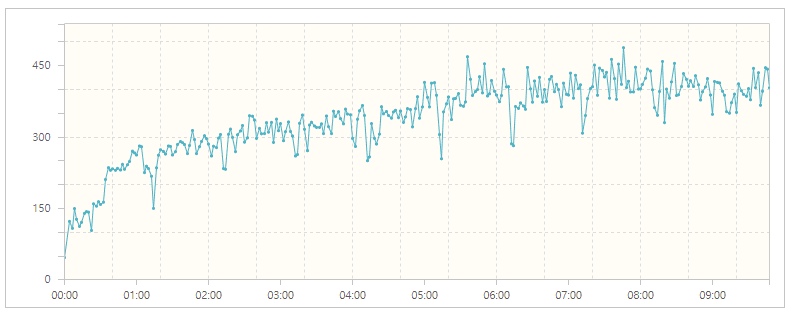
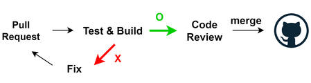
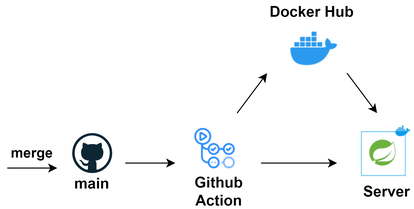
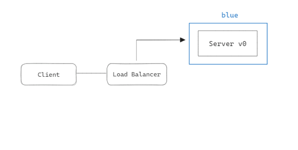
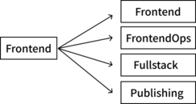

# 주요 포인트

이번 글에서는

- **프로젝트 소개 및 진행 과정**
  
- **성과, 문제와 해결**

에 대해 이야기 해보겠습니다.

<br>

**링크를 통해 [코드](https://github.com/woosungkim0123/devridge-api)를 확인하실 수 있습니다.**

# 프로젝트 소개

DEVRIDGE는 채용 공고와 학습 과정을 결합하여 **맞춤형 학습 로드맵**을 제공하고 학습 자료(영상, 책)를 소개하는 서비스 입니다.

## 프로젝트 관리

<br>
<center>



</center>
<br>

1. 이슈 등록: Jira를 사용하여 프로젝트 관련 이슈들을 등록하고 관리

2. 이슈 기반 브랜치 전략: 각 등록된 이슈에 대해 고유한 브랜치를 생성하여 개발을 진행
   
3. 개발 및 코드 리뷰: 개발이 완료된 기능은 풀 리퀘스트를 통해 동료의 코드 리뷰

4. 병합: 코드 리뷰가 성공적으로 통과한 코드를 병합(merge)

## 프로젝트 구조

<br>
<center>



</center>
<br>

## 역할

### 1. DB ERD 설계

<br>
<center>



</center>

(이미지를 클릭하면 확대하여 볼 수 있습니다.)

<br>

### 2. 회원 인증 & 인가 처리

프로젝트에서 회원 인증과 인가 처리를 담당하며, Spring Security와 OAuth2를 사용해 효율적으로 관리할 수 있는 모듈을 개발했습니다. 

이 모듈은 다양한 플랫폼의 인증 정보를 간단히 추가하고 적용할 수 있도록 설계되어, 새로운 인증 플랫폼을 손쉽게 등록할 수 있습니다.

```java
public static OAuth2Attribute of(String provider, Map<String, Object> attributes) {
    switch (provider) {
        case "google":
            return ofGoogle(provider, attributes);
        case "kakao":
            return ofKakao(provider, attributes);
        default:
            throw new UnsupportedProviderException(provider);
    }
}

private static OAuth2Attribute ofGoogle(String provider, Map<String, Object> attributes) {
    // google에서 보낸 포맷에 맞는 데이터 처리
}

private static OAuth2Attribute ofKakao(String provider, Map<String, Object> attributes) {
    // kakao에서 보낸 포맷에 맞는 데이터 처리
}
```

<br>

### 3. 채용 맞춤형 로드맵 로직 개발

<br>
<center>


</center>
<br>

채용 공고와 학습 자료를 결합하여 채용 공고에 맞는 로드맵을 제공하도록 로직을 개발하였습니다.

<br>

# 성과 

## 1. 서비스 성능 약 2배 개선

채용 공고에 맞는 로드맵을 제공하기 위해 요청마다 복잡한 JOIN 연산을 수행해야 했습니다.

채용 공고는 만료 기한이 정해진 데이터, 학습 데이터는 변경이 적은 데이터라 생각하였고, 이런 정적 데이터를 요청마다 연산하는 것이 리소스 낭비라고 판단하였습니다.

<br>
<center>



</center>
<br>

이런 부분에서 성능 개선의 여지가 있었고, **역 정규화(denormalize)** 전략을 사용해서 채용 공고와 학습 자료를 사전에 결합함으로써 복잡한 JOIN 연산을 줄일 수 있었습니다.

> 역정규화 (Denormalization)
> 
> 데이터베이스의 정규화된 구조를 일부러 중복을 허용하게 하여, 조인 연산을 줄이고, 읽기 성능을 향상시키기 위한 방법입니다.

<br>

nGrinder를 사용해 측정해본 결과, 기존 177 TPS에서 337 TPS로 약 2배 개선된 것을 확인할 수 있었습니다.

<br>

### 성능 개선 전 (Pre-optimization)

TPS : 177.1  
Vuser : 99, Errors : 0



<br>

### 성능 개선 후 (Post-optimization)

**TPS : 337.8**   
Vuser : 99,  Errors : 0



<br>

## 2. 멀티 모듈 아키텍처로 개선

프로젝트 초기에는 Admin, Api, Domain의 모든 기능을 단일 서버 내에 통합하여 개발했습니다. 
이 구조는 개발 초기에는 관리와 배포가 수월했지만, 시간이 지남에 따라 유지보수와 확장성에 많은 어려움을 겪게 되었습니다.

<br>

이를 해결하기 위해 단일 구조에서 Admin, Api, Domain으로 나누어 각각 독립적인 멀티 모듈 구조로 개선하였습니다. 이 변경을 통해 각 모듈은 자신의 역할에 더욱 집중할 수 있게 되었으며, 시스템 전체의 유지보수성과 확장성이 향상되었습니다.

### 개선점

기존보다는 나아졌지만 개선한 멀티 모듈 구조는 서비스가 점점 커질 수록 공통 (Common) 모듈이 점점 커지고 리팩토링이 힘든 지점에 이를 수 있다는 문제가 있다는 사실을 알게 되었습니다.

'공통 모듈의 저주'에 대해서는 밑에 포스트에 자세히 정리되어 있으니 참고하시면 좋을 것 같습니다.

[멀티모듈 설계 이야기 with Spring, Gradle](https://techblog.woowahan.com/2637/)

<br>

## 3. CI / CD 및 무중단 배포 도입

개발 과정에서 코드 통합과 배포의 효율성을 높이기 위해 CI/CD (지속적 통합 및 지속적 배포)를 도입하였습니다. 

CI / CD를 도입함으로써 코드의 품질을 지속적으로 관리할 수 있게 되었고, 코드 변경 사항을 신속하게 테스트하고 배포할 수 있는 체계를 구축했습니다.

<br>

### 지속적 통합(CI)

<br>
<center>



</center>
<br>

이전에는 코드를 통합하는 과정에서 리뷰어와 개발자가 직접 코드를 검토해야 했기 때문에 오류가 포함된 코드가 메인 저장소에 반영되는 경우도 있었습니다.

CI를 도입함으로써, 메인 저장소에 통합할 때 자동화된 빌드와 테스트가 실행되어, 코드에 문제가 있는지 신속하게 파악하고 해결할 수 있게 하였습니다.

<br>

### 지속적 배포(CD)

<br>
<center>



</center>
<br>

이전에는 코드 변경사항을 수동으로 배포해야 했기 때문에 실수나 환경 설정 문제로 인한 오류가 발생할 위험이 높았습니다. 

지속적인 통합(CD)을 도입하여 자동으로 배포하게 함으로써 이러한 문제들이 대폭 감소하였습니다.

<br>

### 무중단 배포

<br>
<center>



</center>
<br>

서비스의 가용성을 최대화하기 위해 무중단 배포를 도입하였습니다. 

Blue/Green 배포 전략을 사용해 기존 버전(Blue)과 새 버전(Green)의 서비스를 동시에 운영하며, 새 버전의 안정성을 확인한 후 트래픽을 이전하여 가용성을 저해하지 않고 서비스를 업데이트 하였습니다.

> 서비스 가용성  
> 
> 얼마나 안정적으로 사용자에게 접근 가능한 상태를 유지하는지를 나타내는 지표

<br>

# 문제와 해결

## 문제 상황

기획 변경으로 유사한 로드맵을 가진 새로운 직군이 도입되었습니다. 

이로 인해 기존 직군과 겹치는 코스 정보가 증가하고, 이와 연계된 학습 자료들도 대량으로 중복되는 문제가 발생했습니다.

<br>
<center>



</center>

## 해결

### 문제 인식

유사한 코스와 학습 자료들의 중복은 데이터 관리를 복잡하게 만들며, 유의미한 통계를 도출하는 데도 장애가 된다고 판단하여 이 문제를 해결하기로 결정했습니다.

### 고민과 해결

선택한 해결책은 데이터베이스(DB) 설계를 재구성하고 로직을 수정하며 중복 데이터 삭제 하는 방법이였습니다. 

그러나 MVP 배포가 임박한 상황에서 이런 대규모 변경을 시행하면 배포 일정이 지연될 위험이 있었습니다. 지연이 계속되면 프로젝트 전체 일정에 차질이 생길 수 있기 때문에, 어느 상황에서도 배포 일정을 지키는 것이 우선이었습니다.

<br>

결국, MVP를 우선 배포하고, 이후 긴급하게 DB와 로직 수정을 진행하는 방식을 선택했습니다. 

# 맺으며

이번 프로젝트를 통해 기획부터 유지 보수까지 프로젝트의 전 과정을 직접 경험했습니다. 

시간 제약으로 인해 자동 크롤링 및 배치 처리를 통한 데이터 생성을 완성하지 못한 점은 큰 아쉬움으로 남습니다. 

<br>

그러나 이 과정 속에서 많은 것을 배웠습니다.

가장 귀중한 교훈 중 하나는 데이터와 성능 지표를 수치로 표현하는 것의 중요성이었습니다. 백엔드 시스템에서 성능을 평가하고 개선하기 위해서는 철저한 성능 테스트가 필수적임을 깨달았습니다. 또한, 다양한 문제에 직면하면서 이를 해결하고 시스템의 성능을 개선하는 과정에서도 많은 성장을 경험했습니다.
